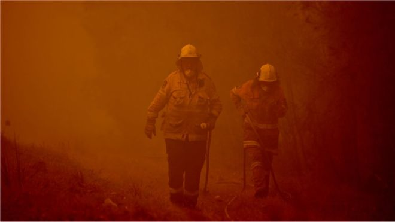
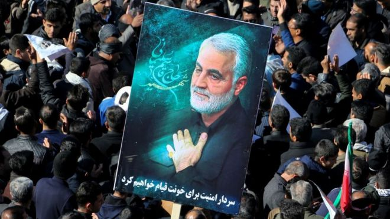

<!DOCTYPE html>
<html lang="en">
    <head><meta charset="utf-8">
        <meta http-equiv="X-UA-Compatible" content="IE=edge">
        <meta name="Description" content="News and articles">
        <title>Shark news</title>
        <meta name="viewport" content="width=device-width, initial-scale=1">
        <link rel="icon" href="fav.ico">
        
    </head>
    <body> 
        
 
            <section id="introSection"> 
                
 
                    <header> 
                        
                    </header> 
                    <nav> 
                        <a href="Hot_news.html" title="Go to about hot news section"> Hot news </a> 
                        <a href="sports.html" title="Go to sports section"> Sports </a>
                        <a href="celebs.html" title="Go to celebreties section"> Celebreties </a>
                       <a href="contacto.html" title="Go to contact section"> Contact </a> 
                   </nav> 
                    
 
                        <h1><strong>Australia fires: How the world has responded to the crisis</strong> </h1> 
                         
                         
                        
 The world has watched with horror as bushfires have torn across Australia, leaving a trail of destruction in their wake.

                            The blazes have razed almost 2,000 homes, and killed at least 25 people and hundreds of millions of animals since they began in September.
                            
                            People in Australia and abroad, including politicians and celebrities, have been eager to find ways to offer assistance and support.
                            
                            But authorities have warned that some kinds of help can actually be a hindrance and overwhelm fire-affected communities.
                            
                            Here are some of the ways that the world has responded to Australia's bushfire crisis, and what help those responding to the crisis say is needed.
                            
                            Creative fundraising
                            Many people have made financial donations to help with the response to the crisis.
                            
                            One fundraiser for fire services in New South Wales (NSW), launched by Australian comedian Celeste Barber, raised more than A$20m (£10.6m; $13m) in just 48 hours. It's now topped A$30m, with donations from more than 1.1 million people.
                            
                            Big business in Australia has also pledged significant contributions.
                            
                            Some of the biggest sums offered to the relief efforts have come from celebrities.
                            
                            US singer Pink, Australian pop star Kylie Minogue, Oscar-winning actress Nicole Kidman, British singer Elton John and Australian actor Chris Hemsworth are among those to make major donations.

                        <h1></h1> <strong>The US, Iran and Qasem Soleimani story explained in 400 words</strong> </h1> 
                         
                         
                        
 The US and Iran have long been foes.

                            Problems can be traced to at least 1979, when Iran's US-backed shah was overthrown and the country became an Islamic republic.
                            
                            That year, amidst the fallout from the revolution, dozens of Americans were taken hostage inside the US embassy in the capital Tehran. Relations have been frosty ever since.
                            
                            There were signs of a diplomatic thaw in 2015, when Iran agreed a landmark deal to limit its nuclear programme, allaying international concerns. It did so in return for the lifting of tough economic sanctions.
                            
                            But the election of US President Donald Trump the following year posed a challenge. He hated the nuclear accord, which he branded "the worst deal ever negotiated".
                            
                            In 2018, he abandoned it altogether and reinstated US sanctions to force Iran's leaders to agree to a new deal - something they rejected, even as the Iranian economy was sent into a deep recession.
                            Mr Trump stepped up the pressure in May 2019 by applying secondary sanctions on countries that continued to do business with Iran.

                            Relations further deteriorated when six oil tankers were sabotaged in the Gulf of Oman in May and June. Washington accused Iran of being behind these attacks. Iran denied this.
                            
                            In July, Tehran started suspending some of the commitments it had made under the nuclear deal.
                            
                            Then, in late December, the US blamed an Iranian-backed militia for a rocket attack which killed an American contractor in northern Iraq.
                            
                            Washington retaliated by bombing bases associated with the militia in Iraq and Syria, killing at least 25 fighters.
                            
                            These bombings sparked a backlash in Iraq. The US embassy in the capital, Baghdad, was attacked by crowds of protesters.
                            
                            President Trump blamed Iran for orchestrating the attack and warned it would "pay a very big price".

                            
                     
 
                
 
            </section> 
            <footer><time>07.01.2020</time>
Anna
</footer>
        

    </body>
</html>                
